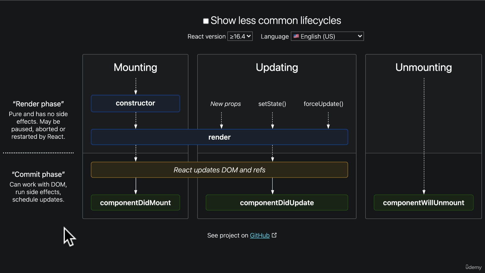

# REACT

### React Concepts;

- Don't touch the DOM , i will do it(React is declarative)
- Build websites like Lego box (Components based architecuture)
- Unidirectional Data flow (Virtual Dom and data flow top to bottom)
- UI, The rest is up to you (React Desktop, React 360)

#### Diff between React and React-dom library

**_"React" is the core JavaScript library used to build reusable UI components, while "ReactDOM" is a separate package specifically responsible for rendering those React components into the actual browser's DOM (Document Object Model), essentially acting as the bridge between React's virtual DOM and the real DOM on the web page;_**

##### What is Babel

_Babel is a JavaScript compiler that transpiles modern JavaScript (ES6+, JSX) into older versions (ES5) that browsers can understand._

##### What is webpack?

_Webpack is a module bundler that takes multiple files (JS, CSS, images, etc.) and bundles them into a single optimized file._

**Use Case of Babel in React**

- Transpiles JSX → Converts JSX (React’s syntax extension) into plain JavaScript.
- Converts ES6+ Features → Enables the use of modern JavaScript features like arrow functions, optional chaining, etc., in older browsers.
- Polyfills → Adds support for missing features in older environments.

**Use Case of Webpack in React**

- Module Bundling → Combines JS, CSS, images, and other assets into a single bundle.
- Code Splitting → Optimizes performance by loading only necessary chunks of code.
- Hot Module Replacement (HMR) → Enables real-time updates in development without refreshing the page.
- Loaders & Plugins → Supports Babel, CSS preprocessing, image optimization, etc.

**setState in class Component**

- In class components, setState performs a shallow merge of the new state with the existing state. In React class components, setState is the primary way to update the component state. It has several important behaviors and characteristics.

```
class MyComponent extends React.Component {
  constructor(props) {
    super(props);
    this.state = {
      name: "John",
      age: 25
    };
  }

  updateAge = () => {
    this.setState({ age: 26 }); // Only 'age' is updated, 'name' remains unchanged
  };

  render() {
    return (
      <div>
        <p>Name: {this.state.name}</p>
        <p>Age: {this.state.age}</p>
        <button onClick={this.updateAge}>Update Age</button>
      </div>
    );
  }
}

## Best practice to write setState
 updateAge = () => {
    this.setState((state, props) => {
      return { age: 26 }
    }, () => {
      console.log(this.state);
    }); // Only 'age' is updated, 'name' remains unchanged
  };

## Syntax ->   setState(stateUpdatFunction(), callbackFunction())
```

✅ _Shallow Merge_ Behavior

- Only the age field is updated.
- The name field remains unchanged.

<br/>

#### Single Page Application(SPA)

SPA stands for Single Page Application. It is a web application or website that loads a single HTML page and dynamically updates content as the user interacts with it, without requiring a full page reload.

**Key Characteristics of an SPA:**

- _Client-Side Rendering (CSR)_: The application runs mostly on the client side using JavaScript (or frameworks like React, Angular, or Vue.js).
- _Fetch API_: Uses asynchronous requests to fetch and update data without reloading the page.
- _Improved User Experience_: Faster transitions and a smoother, app-like experience.
- _Uses Browser History API_: URL changes without full-page reloads, making navigation seamless.

## React Life Cycle

1. constructor() - _Initializing the Component_

- This is the first method that runs when a component is created.
- It is used to initialize state and bind event handlers (if needed).
- You must call super(props) first before using this.

2. render() - _Displaying the UI_

- This method returns JSX (UI) that React displays on the screen.
- It re-runs every time the state or props change.

3. componentDidMount() - _Runs After First Render_

- This method runs only once, after the component is displayed on the screen.
- It is used for fetching data, setting timers, or adding event listeners.

Flow => 1(constructor) -> 2(render) -> 3(componentDidMount) -> 2(rerender)

### Optimization

Instead of defining an inline function inside render(), define it at the class level. This prevents the function from being reinitialized on every re-render, improving performance.

```
          onChange={(e) => {
            let searchField = e.target.value.toLocaleLowerCase();

            this.setState(() => {
              return { searchField };
            });
          }}

          #optimized
          onSearchChange = (e) => {
            let searchField = e.target.value.toLocaleLowerCase();

            this.setState(() => {
              return { searchField };
            });
          };

```

<br />

In class components, this.props is an object that holds the values passed from a parent component to the child component. It allows you to pass data and functions from one component to another.

React always render in 2 cases when setState is called or props are modified.

**Note: Css files are not limited to folder structure it will be bundled and applicable for across the application.**

### React Life Cycel



# React Functional Component

### Pure vs. Impure Functions in JavaScript

1. Pure Functions

- Always return the same output for the same input.
- No side effects (does not modify global variables, API calls, or DOM).

2. Impure Functions

- Change external state (modifies variables, manipulates DOM, makes API calls).
- May return different outputs for the same inputs.

### useState hook

The useState hook is a fundamental hook in React that allows functional components to have state, making them more dynamic and interactive.

```jsx
import { useState } from 'react';

function Counter() {
  const [count, setCount] = useState(0);

  return (
    <div>
      <p>Count: {count}</p>
      <button onClick={() => setCount(count + 1)}>Increase</button>
    </div>
  );
}
```

**When Does useState Trigger a Re-render?**

State Updates via setState

1. When you call setState(newValue), React schedules a re-render.

- The component re-executes and updates the UI based on the new state. Only If State Actually Changes

2. React compares the previous and new state (Object.is comparison).

- If they are the same (prevState === newState), React does not re-render.
- Inside an Event Handler or Effect

3. Calling setState inside an event handler, like onClick, schedules a re-render.

- If used inside useEffect, the component re-renders when dependencies change.

### useEffect Hook

The `useEffect` hook allows you to perform side effects in functional components, such as data fetching, subscriptions, or manually changing the DOM. It runs after the component renders.

**Example Usage**

```jsx
import { useEffect, useState } from 'react';

function ExampleComponent() {
  const [count, setCount] = useState(0);

  useEffect(() => {
    console.log(`Count updated: ${count}`);
  }, [count]); // Runs when 'count' changes

  return (
    <div>
      <p>Count: {count}</p>
      <button onClick={() => setCount(count + 1)}>Increase</button>
    </div>
  );
}
```

**When Does useEffect Run?**

1. After Initial Render

- useEffect runs after the component mounts, executing the callback function.

2. When Dependencies Change

- If you pass a dependency array [dep1, dep2], the effect runs only when any of these dependencies change.
- If the array is empty [], the effect runs only once after the first render.

3. Cleanup Function (Optional) - If the effect returns a function, React will run this cleanup function before running the effect again or when the component unmounts.

```jsx
useEffect(() => {
  const interval = setInterval(() => {
    console.log('Interval running');
  }, 1000);

  return () => clearInterval(interval); // Cleanup function
}, []);
```
